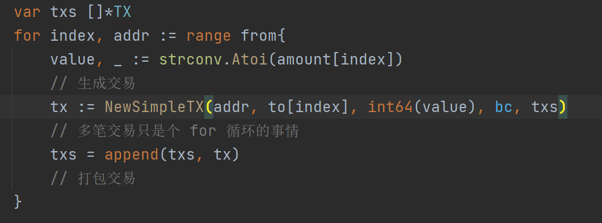
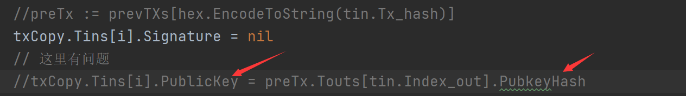

# BlockChain-Learning

---
一部分笔记在[个人博客](http://www.bosshhh.top/)

##  day_1

区块链的特点：

- 可追溯

- 不可篡改

- 去中心化

- 具有完整的分布式存储特性

加密货币的特点：

- 独立性：货币独立存在

- 唯一性：地址、交易的hash都不可重复

- 匿名性  

- 不可篡改：基于加密与时间戳

核心技术：

- P2P

- 现在密码学

- 共识算法(PoW)

- 分布式数据存储：去中心化的技术依据

区块链示意图：


**区块头**包含的结构:

- 时间戳(确保唯一性)

- 区块号码，唯一ID

- 随机数r: 生成hash, 用于工作量证明

- prev_hash：指向前一块，通过其进行回溯

- self_trans_hash: 指向包含交易块的merkle树

    每一棵merkle树包含多个打包在一起的交易

**UTXO(未花费的输出)模式**：

一个UTXO包含n个比特币

交易的最小单位，即交易完后原先的被销毁，一个被用于支付，一个找零给自己。

它记录交易事件，而不记录最终状态，因此要知道某个用户拥有多少比特币，需要对其钱包里的UTXO求和。


**节点**：
    区块被保存在每个节点中，所有节点构成分布式数据库，可以分成：

- 全节点：保存区块的所有信息

- 轻量节点：不能核验一个区块里所有交易记录的有效性，依赖于全节点

- 挖矿节点：处理交易验证，保存区块链副本

**挖矿**：

- 得到创建区块的激励

- 基本概念还是穷举随机数，即使得生成的hash满足以下不等式(nounce为随机数，tx...为10分钟间隔内的所有交易数据)

    `H(nonce‖prev_hash‖tx‖tx‖…‖tx) < target`
新产生的区块需要广播验证其正确性。
  
**分叉问题**：

- 挖矿分叉：两个矿工同时创建区块，最终由算力决定，矿工们会逐渐去维护更长的链，所以最长的链保留，另一个丢弃

- 硬分叉：

    老节点被视为无效，所以老节点会认为另外的分支（在该分支中新节点认为有效的区块被排除）最长、最有效，然后一直扩展，直到老节点更新，这样就造成了硬分叉，它们再也不会合并。我们不希望这种现象出现

- 软分叉：

    即新节点使用更加严格的协议，而新节点认为有效的区块，老节点肯定也认为有效既能够兼容

**双重支付**：
    
解决方案：

- 历史交易完全公开，如果出现双重支付，则能够查到
- 数字签名，时间戳决定交易顺序，当前交易成功，下一笔交易才能基于该笔交易进行
- 纳入长期共识链，经过验证后，才能交易成功

**<span id="bitEnc">比特币加密算法</span>**

比较基础，没有很复杂的加密算法，非对称主要是基于椭圆曲线求解难题，得到公私钥对

- 非对称加密

- 数字签名：先摘要后签名，防抵赖


**钱包分类：**

- 厚钱包：类似全节点
- 薄钱包：类似轻量节点
- 纸钱包：离线设备

## 比特币区块校验

流程解析：

1. 接受区块

2. 区块校验，判断是否出错

3. 出错返回1

4. 无错判断该块前区块头与当前末尾块链头的hash是否一致

5. 一致则上链作为新的末尾链头，更新UTXO数据库，检查孤儿区块池

6. 否则放入孤儿区块池，返回1

---

## day_2

比特币交易：

- 包含输入、输出、交易ID

- 每笔交易的输入来自于另一笔的输出(联系)

以太坊(DAPP开发平台):

- 每个DAPP消耗整条链的资源

- 智能合约：自我校验、自我执行的协议

- POW(EThash 内存难解：不与算力直接相关)

- JS框架

EOS(区块链3.0):

- TPS提升

- 不是单纯的公链，开发者可以在EOS上创建公链，链之间不影响资源

- 无交易费(gas)

- DPOS共识算法，超级节点进行验证等

- Hyperledger Fabric: 联盟链

    - 不发行加密货币
    
    - 实现权限区块链的底层基础架构
    
    - 身份服务：具有身份识别能力
    
    - 策略服务：提供访问控制，授权等一系列功能(联盟链的特点)
    
    - 区块链服务
    
    - 智能合约
    
    - 上层结构：API, SDK, CLI
    
## 公链实战(包含区块链基本特性)

实现目标：


1. **区块链基本结构**

定义Block和BlockChain结构

复习下go基础知识：

- bytes.buffer

  其底层实现是[]byte即字节切片，有 `Read/Write` 方法

  初始化一般直接用 `new`

  `buffer := new(bytes.buffer)`
  
  转化为字节数组通过`binary.Write`方法
  `binary.Write(buffer, binary.BigEndian, data)`
  
  字节数组拼接 `bytes.Join()` eg:
  
```
  s := [][]byte{[]byte("foo"), []byte("bar"), []byte("baz")} 
  fmt.Printf("%s", bytes.Join(s, []byte(", ")))
  Output:
  foo, bar, baz
```

**PoW**编写：

在创建区块时引入工作量证明，添加nonce字段作为碰撞随机数和pre_hash以及生成的当前区块的信息共同生成hash，
难度通过左移来限制hash的前缀0的个数

```
    target := big.NewInt(1)
    target = target.Lsh(target, 256-targetBit)
```

**数据持久化**：

bolt-db: 轻量级KV数据库(go编写的)

- 增删改查

- 自定义数据结构进行序列化, 这里用到的是go自带的gob库的`Encode/Decode`方法，一般用于rpc

---

## day_3

**数据库迭代**：

- 区块遍历：数据库读，通过`genesis block`的`Pre_hash`为空确定跳出条件

- 自定义 `iterator ` 通过`Next()`方法遍历 
  
  BlockChainIterator与BlockChain的差异
  
  BlockChain 就像是链表尾，一直维护的最末尾的那块信息，和整条链的部分信息

**复盘：**

已实现的部分是：

1. 区块/区块链的基本机构即相关操作
2. PoW算法实现
3. 数据持久化，读写操作，遍历操作

**go cmdLine**：

- `flag`包的使用，封装的很方便，比较简单
  
  之前自己玩过的例子：

  ```
  flag.StringVar(&FileType, "f", "exe", "FileType to search.")
  flag.StringVar(&Dir, "d", "D:\go\src\VirusProject\", "directory")
  flag.Parse() // 解析输入
  ```
  将cmdline输入赋值给第一个参数

**实现CLI**：

定义 CLI结构体，并添加方法，基于已经定义的block和bc结构。
用到 `flag.NewFlagSet()/Parse()/Parsed()` 方法

**git 操作**：

基本的操作，快速略过

- 版本回退
  - `git reset HEAD <FILENAME>` 回退单个文件
  - `git reset --hard HEAD^` 回退所有文件，慎用
  - `git reset --hard <commit_id/(前六位)>` 回退到指定版本
  
- 工作区撤销修改 `git checkout -- <filename>`
  
- 删除文件：`git rm <filename>`

- 分支 
  - `git branch (-d -D)` 
  - `git checkout branch_name`
  - `git merge branch_name`
  
- 工作现场保存

  - `git stash` : 存储当前的工作现场
  
  - `git stash list` : 查看已保存的工作现场
  
  - 工作现场恢复
  
    - `git stash apply` : 不会删除缓存栈的内容
    
    - `git stash pop` : 出栈
  
    - `git stash apply stash@{n}` 恢复第n次保存的现场
  
- `tag`管理

  - `git tag -a <tag_name> -m <description>`

  - `git tag / git show <tag_name>`
  
  - `git tag -d ` 本地标签删除  `git push origin :ref/tags/<tag_name>`删除远程标签
  
  - `git push origin <tag_name>`
  
  - `git push origin --tags` 推送所有分支
  
**编写直接获得区块链对像函数**：

通过 db 对象 和保存在数据库中的最新区块的hash可以方便的构建

**看下《计网 运输层》**  ~~太菜了~~

---
# day_4

**比特币交易**

区块是在交易的基础上生成的。

交易分类：

- coinbase
  
  - 挖矿奖励机制，系统发送，无输入
  
- 普通转账交易：包含输入输出

交易结构：

- 包含交易唯一标识： `Tx_hash`, 区块所有的交易hash合成后作为字段来用于Pow算法

- 交易输入结构
  - 上一笔交易hash
  - 被花费的UTXO的index，单个UTXO是交易的最小单位，花费后剩余的将转给自己的地址
  - 锁定脚本，判断属于者
  
- 交易输出结构
  - 总量
  - 锁定脚本，判断属于者

实现交易结构到[]byte的转换函数

交易输入输出

实现 `coinbase`

- 在创建创世区块时就得把交易数据传进去

调bug废了我好长时间。。一直回溯都没发现

直到我看到了这玩意儿:


~~令人头大~~ 怪不得一直传参传不过去，弄得我还以为是gob的编解码有bug了呜呜呜

**交易实现原理**：

- UTXO概念

上面介绍过了，比特币中的钱包是UTXO的集合。

- 有效交易条件：
  
  - 交易签名：UTXO的拥有者
  
  - 如果输出的UTXO被引入过一次，则它不能够被再次引用
  
- 交易过程：

  - `coinbase`交易：接收系统提供的挖矿奖励，包含输入输出
  
  - 普通转账交易：
  
    1. 确认钱是否足够，比特币查询余额需要遍历用户所有可用的UTXO
  
    2. 创建交易：可能涉及将一个UTXO拆分为多个，有些发送给被支付者，有些返回给支付者的地址
  
**转账CLI实现**：

`cmdline` : `send -from [addr1] -to [addr2] -amount [value]`

- 为实现一个区块能包含多笔交易，即类似于如下的命令行支持
  
  `send -from [a, b] -to [b, a] -amount [5, 10]`

  我想的是通过json与自定义交易结构(不是`TX`)来传， `encoding/json`库提供了 `Marshal`和`Unmarshal`方法，可以在自定义结构之间互相转换。而讲的是通过数组来转换

- 生成转账交易

交易奖励通过硬编码写入，需要修改，遍历来得到用户的余额。[]byte到十六进制的转换有点问题

---
## day_5

**查询余额**：

得到指定地址的余额

- 流程：

  1. 遍历区块链得到所有的交易
  2. 遍历交易，得到与指定地址有关的交易输出
  3. 判断每个交易输出是否被花费

- 编程思想：先写出代码框架，测试普通的逻辑功能即实现路径是否正确(一般先用打印字符串代替)
          ，再去完善细节的定义
  
- 查找已花费的输出
  
  - 每笔交易中input的index表明引用的上一块交易的outputs, 即已花费的output 
    
  - 因此可以用map存起来, key 对应"引用的"交易hash, 切片是该交易中引用的outputs
  
- 查找未花费的输出

  - 原理实现：在查找已花费输出的过程中我们将其保存在在一个map中，那么我们要查找对应地址未花费的输出
  只需要再次遍历，并且与map中的切片进行对比，如果某一交易hash下不包含则说明这个output并没有花费。
    
  
~~话说回来go语言没有 in 也没有Container，太垃圾了~~

**UTXO定义**：

结构：

```
type UTXO struct {
	// 对应的交易hash
	Tx_hash []byte
	// 该交易中的index 即OUPUT对应的索引
	Out_index int
	// OUTPUT结构
	Output *TxOutput
}
```

注意其与单纯的TX_Ouput的区别，其实我觉得就是对于其更细化更全面的一个定义，而单纯的TX_Ouput
不需要这么多信息。从编写代码的过程也可以看出来

**转账实现**：

- 思路：遍历可用的UTXO，只要达到金额即返回，没必要遍历所有的。

- 依托之前的`生成交易`和`Send`函数

**多笔交易实现**：

逻辑问题：只从数据库查找UTXO的逻辑可能会导致余额不足

解决方案：考虑当前未打包到区块中的指定地址的UTXO。先查缓存区的输入，在查整个数据库的输入，一并合成为待比较的已花费输出

生成的交易缓存需要我们在挖矿创建的时候作为参数传进去，很显然在多笔交易中，前面的交易就成为了后面交易的缓存。



至此，交易的整个逻辑就基本实现完成了，好耶！

**比特币地址加密**：

先看之前记过的[加密过程解析](#bitEnc)

地址构造组成：

- Version

- PubKey_Hash: RIPEMD160 + SHA-256 (PubKey)

- CheckSum: SHA-256 x 2(PubKey_Hash)

---

## day_6

**base64/base58编码**：

base64:

1. Base64是网络上最常见的用于传输8Bit字节码的编码方式之一，Base64就是一种基于64个可打印字符来表示二进制数据的方法。

2. 把3个8位字节直接转化为4个(6位，前两位补0)字节

3. 结尾不足6位填充0字符且输出 "="作为标记, 有一个专门的编码表

4. golang的包 `encoding/base64`

base58: 

与base64类似，但去掉了一些容易混淆的数字和字母：0（数字0）、O（o的大写字母）、l（ L的小写字母）、I（i的大写字母）以及 "+", "/"

我感觉讲解的base58代码编写有问题，不是这个原理，有一个地方不应该返回切片下标，而是input切片中有0x00的都给替代为
‘1’，但为了之后方便比较，懒得改了。可以参考[正确的base58编码](https://blog.csdn.net/weixin_45304503/article/details/118635237?utm_medium=distribute.pc_relevant.none-task-blog-2~default~baidujs_title~default-1.control&spm=1001.2101.3001.4242)

**钱包**：

- 存储公-私钥对，所以结构定义为

```
type Wallet struct {
	// 私钥，基于椭圆加密
	PrivateKey ecdsa.PrivateKey

	// 公钥
	PublicKey []byte
}
```

**通过钱包获得地址**：

- 过程：由图解来进行
  
  - version 版本前缀，一个字节，用来创造一个易于辨别的格式，例如bitcoin address 的
  version prefix 为0x00，base58编码后就为1
  
  - pubKey hash: 160位 20字节

  - checkSum: 4个字节, 添加到编码数据的末端，用于检错，两次SHA256, 因为hash函数
  的一个重要应用就是用了检测数据的完整性和一致性。
    
  - 拼接(Version + PukKey_Hash + CheckSum)，再用base58编码 
    
判断地址有效性：逆过程，解码，拆分，
  
**创建钱包集合**：

- 方便对钱包、地址进行维护

- 创建钱包命令行

首先也需要对钱包集合数据进行持久化。

`gob`库太强了，如果结构中包含`interface`，可以调用`Regiter()`函数进行注册，这样它就能够正确的解析。

把钱包地址存进文件中还注意到了一个细节，就是用到的 `ioutil.WriteFile()`它写文件不是append而是truncate
。这样就不会重复的存储map数据而导致资源的浪费了。太强了！！！

- 得到钱包地址的命令行

**钱包与交易输入输出相关联**

- `Signature(暂时未用)` 和 `PublicKey`

- `PubKeyHash` ：标记钱属于谁

完成了这些字段的加密（加密库用的都是go自带的，包括椭圆加密），以及交易正常功能的修改

**交易签名 Signature**

标记交易发起人是谁，可以防止抵赖，保证交易的完整性。验证者用其同时发送的公钥对签名进行解密并比对

工作流程：

1. 创建签名，在生成交易之后对交易进行签名

2. 签名验证：通过发送过来的信息即公钥对其私钥加密的签名进行验证，肯定是在区块打包上传之前

3. 即生成公-私钥对的用户才能产生这笔交易

主要应用的函数 : `ecdsa.Sign()/.Verify()`

--- 

## day_7

**交易签名代码实现**：

需要对不需要签名的字段进行置空处理，也就是说必须对原数据做一个裁剪，这里返回了一个copy。

**签名验证**：

- 先获取交易签名的字段

- 构建椭圆加密过程使用的相同的椭圆, 椭圆加密返回的r, s数据长度大小相同

- 椭圆加密的公钥是(X, Y)坐标对

验证出了点bug，写个测试程序，感觉逻辑没啥问题啊，难道preTXs那儿错了？
~~视频的bug更多，然后还直接跳了？惊呼~~

```go
package main

import (
	"crypto/ecdsa"
	"crypto/elliptic"
	"crypto/rand"
	"fmt"
	"log"
	"math/big"
)

func main() {
  curve := elliptic.P256()
  // 基于椭圆加密
  priv, err := ecdsa.GenerateKey(curve, rand.Reader)
  if err != nil {
    log.Panicf("ecdsa generate key failed. %v\n", err)
  }

  pubKey := append(priv.PublicKey.X.Bytes(), priv.PublicKey.Y.Bytes()...)

  r, s, err := ecdsa.Sign(rand.Reader, priv, []byte("test ecdsa"))

  x := big.Int{}
  y := big.Int{}
  pubKeyLen := len(pubKey)
  x.SetBytes(pubKey[:(pubKeyLen / 2)])
  y.SetBytes(pubKey[(pubKeyLen / 2):])

  rawPubkey := ecdsa.PublicKey{Curve: curve, X: &x, Y: &y}

  if !ecdsa.Verify(&rawPubkey, []byte("test ecdsa"), r, s) {
    fmt.Println("false!")
  } else {
    fmt.Println("true")
  }
}

```

```
output:
	true
```

好在bug解除了，~~爽~~，`txCopy`写成了`tx`直接把原来的公钥给赋成了`nil`。

但问题还是得说的



1. 这里`pubkeyhash`赋值给`pubkey`很显然就不对，而且你这样签名的时候还是得签，摘要的时候就一并拿着呗，感觉有点逻辑不自洽

2. preTx在这并不需要，首先就是上面的逻辑问题，另外如果是想获取公钥，那么在生成交易的时候就已经链接好了，并不需要通过索引来找啊。

**挖矿奖励**：

即对生成区块的矿工系统给他分配一定的币。

本程序默认地址中第一个抢到记账权并获得奖励。为了区别创世区块的hash, 将生成交易的交易的时间也作为
一个字段来生成`tx_Hash`

事实上每个区块都应该包含多个交易，而且根据矿工的算力来决定能够得到记账权的概率。

需要注意的是判断是否是coinbase的函数  `IsCoinbase` 应该更新，视频好像没有改。

**UTXO优化**：

现状：UTXO至少得有O(n^3)的复杂度，如果区块个数多了，效率下降会挺明显的，需要优化。

想法：

- 建立一个只包含UTXO的数据库？

- UTXO的经常变化，如何维护？重置UTXO，连续读写数据库文件会不会也影响效率？

- 把数据库的更新放在生成新区块之前

在次基础上做到基于创建的数据库表中查找指定地址的utxo

又发现个错误，它只在创建创世区块时更新数据库肯定是不行的，必须得在每上线一个区块就得更新，这样自然而然
也能引出下一步的逻辑修正，即多个交易，前面的交易可能成为后面交易的前提，但由于还未打包导致不能识别这些utxo

而对于签名，如果缓存中包含指定交易hash的关联输入，我们是不是也得考虑到对其进行签名？即
已经被打包上传后的区块中的output被在缓存区中的交易输入所引用。或者说缓存区的tx_hash(引用的前一个交易的hash)指向的交易在数据库中

经过上面一番工作，我们需要把交易时查找utxo也改为从数据库中查
