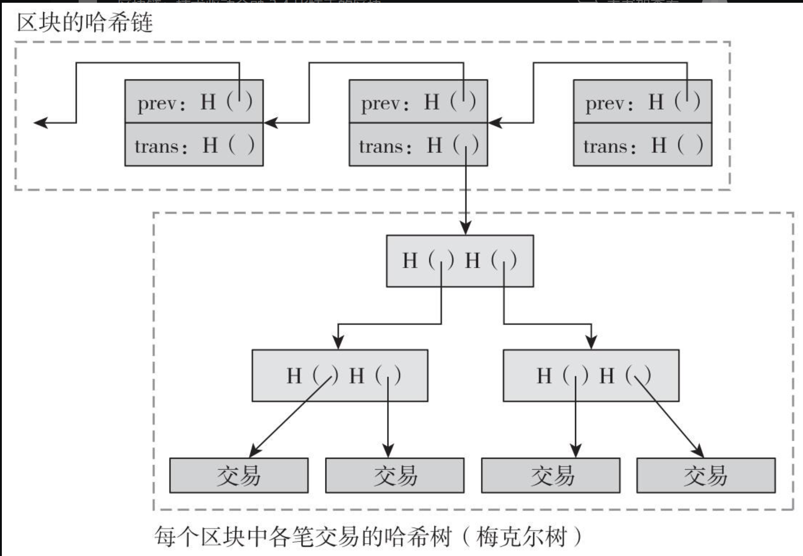
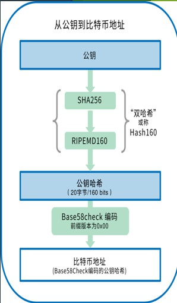
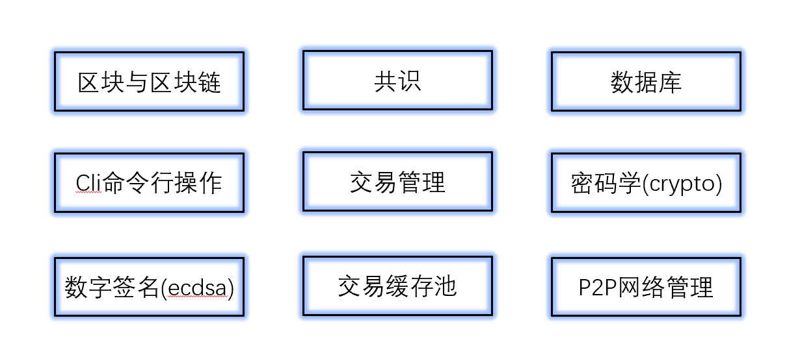
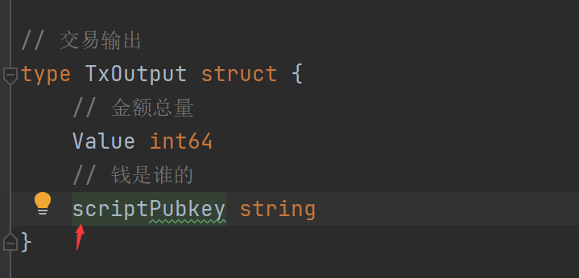

# BlockChain-Learning

---
一部分笔记在[个人博客](http://www.bosshhh.top/)

##  day_1

区块链的特点：

- 可追溯

- 不可篡改

- 去中心化

- 具有完整的分布式存储特性

加密货币的特点：

- 独立性：货币独立存在

- 唯一性：地址、交易的hash都不可重复

- 匿名性  

- 不可篡改：基于加密与时间戳

核心技术：

- P2P

- 现在密码学

- 共识算法(PoW)

- 分布式数据存储：去中心化的技术依据

区块链示意图：



**区块头**包含的结构:

- 时间戳(确保唯一性)

- 区块号码，唯一ID

- 随机数r: 生成hash, 用于工作量证明

- prev_hash：指向前一块，通过其进行回溯

- self_trans_hash: 指向包含交易块的merkle树

    每一棵merkle树包含多个打包在一起的交易

**UTXO(未花费的输出)模式**：

一个UTXO包含n个比特币

交易的最小单位，即交易完后原先的被销毁，一个被用于支付，一个找零给自己。

它记录交易事件，而不记录最终状态，因此要知道某个用户拥有多少比特币，需要对其钱包里的UTXO求和。


**节点**：
    区块被保存在每个节点中，所有节点构成分布式数据库，可以分成：

- 全节点：保存区块的所有信息

- 轻量节点：不能核验一个区块里所有交易记录的有效性，依赖于全节点

- 挖矿节点：处理交易验证，保存区块链副本

**挖矿**：

- 得到创建区块的激励

- 基本概念还是穷举随机数，即使得生成的hash满足以下不等式(nounce为随机数，tx...为10分钟间隔内的所有交易数据)

    `H(nonce‖prev_hash‖tx‖tx‖…‖tx) < target`
新产生的区块需要广播验证其正确性。
  
**分叉问题**：

- 挖矿分叉：两个矿工同时创建区块，最终由算力决定，矿工们会逐渐去维护更长的链，所以最长的链保留，另一个丢弃

- 硬分叉：

    老节点被视为无效，所以老节点会认为另外的分支（在该分支中新节点认为有效的区块被排除）最长、最有效，然后一直扩展，直到老节点更新，这样就造成了硬分叉，它们再也不会合并。我们不希望这种现象出现

- 软分叉：

    即新节点使用更加严格的协议，而新节点认为有效的区块，老节点肯定也认为有效既能够兼容

**双重支付**：
    
解决方案：

- 历史交易完全公开，如果出现双重支付，则能够查到
- 数字签名，时间戳决定交易顺序，当前交易成功，下一笔交易才能基于该笔交易进行
- 纳入长期共识链，经过验证后，才能交易成功

**比特币加密算法：**

比较基础，没有很复杂的加密算法，非对称主要是基于椭圆曲线求解难题，得到公私钥对

- 非对称加密

- 数字签名：先摘要后签名，防抵赖



**钱包分类：**

- 厚钱包：类似全节点
- 薄钱包：类似轻量节点
- 纸钱包：离线设备

## 比特币区块校验

流程解析：

1. 接受区块

2. 区块校验，判断是否出错

3. 出错返回1

4. 无错判断该块前区块头与当前末尾块链头的hash是否一致

5. 一致则上链作为新的末尾链头，更新UTXO数据库，检查孤儿区块池

6. 否则放入孤儿区块池，返回1

---

## day_2

比特币交易：

- 包含输入、输出、交易ID

- 每笔交易的输入来自于另一笔的输出(联系)

以太坊(DAPP开发平台):

- 每个DAPP消耗整条链的资源

- 智能合约：自我校验、自我执行的协议

- POW(EThash 内存难解：不与算力直接相关)

- JS框架

EOS(区块链3.0):

- TPS提升

- 不是单纯的公链，开发者可以在EOS上创建公链，链之间不影响资源

- 无交易费(gas)

- DPOS共识算法，超级节点进行验证等

- Hyperledger Fabric: 联盟链

    - 不发行加密货币
    
    - 实现权限区块链的底层基础架构
    
    - 身份服务：具有身份识别能力
    
    - 策略服务：提供访问控制，授权等一系列功能(联盟链的特点)
    
    - 区块链服务
    
    - 智能合约
    
    - 上层结构：API, SDK, CLI
    
## 公链实战(包含区块链基本特性)

实现目标：



1. **区块链基本结构**

定义Block和BlockChain结构

复习下go基础知识：

- bytes.buffer

  其底层实现是[]byte即字节切片，有 `Read/Write` 方法

  初始化一般直接用 `new`

  `buffer := new(bytes.buffer)`
  
  转化为字节数组通过`binary.Write`方法
  `binary.Write(buffer, binary.BigEndian, data)`
  
  字节数组拼接 `bytes.Join()` eg:
  
```
  s := [][]byte{[]byte("foo"), []byte("bar"), []byte("baz")} 
  fmt.Printf("%s", bytes.Join(s, []byte(", ")))
  Output:
  foo, bar, baz
```

**PoW**编写：

在创建区块时引入工作量证明，添加nonce字段作为碰撞随机数和pre_hash以及生成的当前区块的信息共同生成hash，
难度通过左移来限制hash的前缀0的个数

```
    target := big.NewInt(1)
    target = target.Lsh(target, 256-targetBit)
```

**数据持久化**：

bolt-db: 轻量级KV数据库(go编写的)

- 增删改查

- 自定义数据结构进行序列化, 这里用到的是go自带的gob库的`Encode/Decode`方法，一般用于rpc

---

## day_3

**数据库迭代**：

- 区块遍历：数据库读，通过`genesis block`的`Pre_hash`为空确定跳出条件

- 自定义 `iterator ` 通过`Next()`方法遍历

**复盘：**

已实现的部分是：

1. 区块/区块链的基本机构即相关操作
2. PoW算法实现
3. 数据持久化，读写操作，遍历操作

**go cmdLine**：

- `flag`包的使用，封装的很方便，比较简单
  
  之前自己玩过的例子：

  ```
  flag.StringVar(&FileType, "f", "exe", "FileType to search.")
  flag.StringVar(&Dir, "d", "D:\go\src\VirusProject\", "directory")
  flag.Parse() // 解析输入
  ```
  将cmdline输入赋值给第一个参数

**实现CLI**：

定义 CLI结构体，并添加方法，基于已经定义的block和bc结构。
用到 `flag.NewFlagSet()/Parse()/Parsed()` 方法

**git 操作**：

基本的操作，快速略过

- 版本回退
  - `git reset HEAD <FILENAME>` 回退单个文件
  - `git reset --hard HEAD^` 回退所有文件，慎用
  - `git reset --hard <commit_id/(前六位)>` 回退到指定版本
  
- 工作区撤销修改 `git checkout -- <filename>`
  
- 删除文件：`git rm <filename>`

- 分支 
  - `git branch (-d -D)` 
  - `git checkout branch_name`
  - `git merge branch_name`
  
- 工作现场保存

  - `git stash` : 存储当前的工作现场
  
  - `git stash list` : 查看已保存的工作现场
  
  - 工作现场恢复
  
    - `git stash apply` : 不会删除缓存栈的内容
    
    - `git stash pop` : 出栈
  
    - `git stash apply stash@{n}` 恢复第n次保存的现场
  
- `tag`管理

  - `git tag -a <tag_name> -m <description>`

  - `git tag / git show <tag_name>`
  
  - `git tag -d ` 本地标签删除  `git push origin :ref/tags/<tag_name>`删除远程标签
  
  - `git push origin <tag_name>`
  
  - `git push origin --tags` 推送所有分支
  
**编写直接获得区块链对像函数**：

通过 db 对象 和保存在数据库中的最新区块的hash可以方便的构建

**看下《计网 运输层》**  ~~太菜了~~

---
# day_4

**比特币交易**

区块是在交易的基础上生成的。

交易分类：

- coinbase
  
  - 挖矿奖励机制，系统发送，无输入
  
- 普通转账交易：包含输入输出

交易结构：

- 包含交易唯一标识： `Tx_hash`, 区块所有的交易hash合成后作为字段来用于Pow算法

- 交易输入结构
  - 上一笔交易hash
  - 被花费的UTXO的index，单个UTXO是交易的最小单位，花费后剩余的将转给自己的地址
  - 锁定脚本，判断属于者
  
- 交易输出结构
  - 总量
  - 锁定脚本，判断属于者

实现交易结构到[]byte的转换函数

交易输入输出

实现 `coinbase`

- 在创建创世区块时就得把交易数据传进去

调bug废了我好长时间。。一直回溯都没发现

直到我看到了这玩意儿:



~~令人头大~~ 怪不得一直传参传不过去，弄得我还以为是gob的编解码有bug了呜呜呜

**交易实现原理**：

- UTXO概念

上面介绍过了，比特币中的钱包是UTXO的集合。

- 有效交易条件：
  
  - 交易签名：UTXO的拥有者
  
  - 如果输出的UTXO被引入过一次，则它不能够被再次引用
  
- 交易过程：

  - `coinbase`交易：接收系统提供的挖矿奖励，包含输入输出
  
  - 普通转账交易：
  
    1. 确认钱是否足够，比特币查询余额需要遍历用户所有可用的UTXO
  
    2. 创建交易：可能涉及将一个UTXO拆分为多个，有些发送给被支付者，有些返回给支付者的地址
  
**转账CLI实现**：

`cmdline` : `send -from [addr1] -to [addr2] -amount [value]`

- 为实现一个区块能包含多笔交易，即类似于如下的命令行支持
  
  `send -from [a, b] -to [b, a] -amount [5, 10]`

  我想的是通过json与自定义交易结构(不是`TX`)来传， `encoding/json`库提供了 `Marshal`和`Unmarshal`方法，可以在自定义结构之间互相转换。而讲的是通过数组来转换

- 生成转账交易

交易奖励通过硬编码写入，需要修改，遍历来得到用户的余额。[]byte到十六进制的转换有点问题