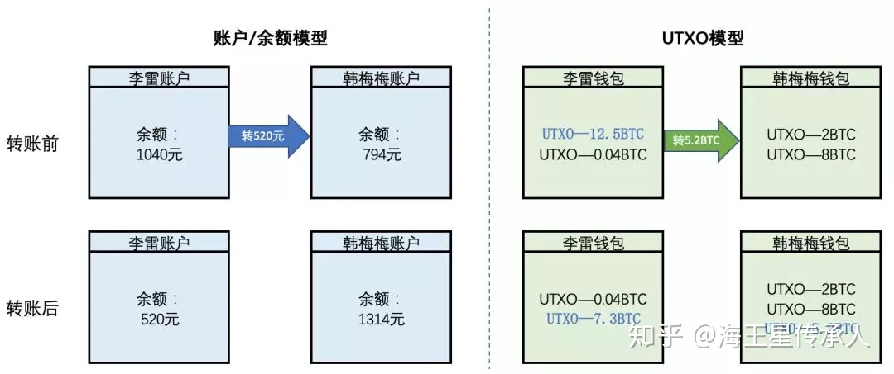

# BlockChain-Learning

---
一部分笔记在[个人博客](http://www.bosshhh.top/)

##  day_1

区块链的特点：

- 可追溯

- 不可篡改

- 去中心化

- 具有完整的分布式存储特性

加密货币的特点：

- 独立性：货币独立存在

- 唯一性：地址、交易的hash都不可重复

- 匿名性  

- 不可篡改：基于加密与时间戳

核心技术：

- P2P

- 现在密码学

- 共识算法(PoW)

- 分布式数据存储：去中心化的技术依据

区块链示意图：

**区块头**包含的结构:

- 时间戳(确保唯一性)

- 区块号码，唯一ID

- 随机数r: 生成hash, 用于工作量证明

- prev_hash：指向前一块，通过其进行回溯

- self_trans_hash: 指向包含交易块的merkle树

    每一棵merkle树包含多个打包在一起的交易

**UTXO(未花费的输出)模式**：

一个UTXO包含n个比特币

交易的最小单位，即交易完后原先的被销毁，一个被用于支付，一个找零给自己。

它记录交易事件，而不记录最终状态，因此要知道某个用户拥有多少比特币，需要对其钱包里的UTXO求和。

**节点**：
    区块被保存在每个节点中，所有节点构成分布式数据库，可以分成：

- 全节点：保存区块的所有信息

- 轻量节点：不能核验一个区块里所有交易记录的有效性，依赖于全节点

- 挖矿节点：处理交易验证，保存区块链副本

**挖矿**：

- 得到创建区块的激励

- 基本概念还是穷举随机数，即使得生成的hash满足以下不等式(nounce为随机数，tx...为10分钟间隔内的所有交易数据)

    `H(nonce‖prev_hash‖tx‖tx‖…‖tx) < target`
新产生的区块需要广播验证其正确性。
  
**分叉问题**：

- 挖矿分叉：两个矿工同时创建区块，最终由算力决定，矿工们会逐渐去维护更长的链，所以最长的链保留，另一个丢弃

- 硬分叉：

    老节点被视为无效，所以老节点会认为另外的分支（在该分支中新节点认为有效的区块被排除）最长、最有效，然后一直扩展，直到老节点更新，这样就造成了硬分叉，它们再也不会合并。我们不希望这种现象出现

- 软分叉：

    即新节点使用更加严格的协议，而新节点认为有效的区块，老节点肯定也认为有效既能够兼容

**双重支付**：
    
解决方案：

- 历史交易完全公开，如果出现双重支付，则能够查到
- 数字签名，时间戳决定交易顺序，当前交易成功，下一笔交易才能基于该笔交易进行
- 纳入长期共识链，经过验证后，才能交易成功

**比特币加密算法：**

比较基础，没有很复杂的加密算法，非对称主要是基于椭圆曲线求解难题，得到公私钥对

- 非对称加密

- 数字签名：先摘要后签名，防抵赖

**钱包分类：**

- 厚钱包：类似全节点
- 薄钱包：类似轻量节点
- 纸钱包：离线设备

## 比特币区块校验

流程解析：

1. 接受区块

2. 区块校验，判断是否出错

3. 出错返回1

4. 无错判断该块前区块头与当前末尾块链头的hash是否一致

5. 一致则上链作为新的末尾链头，更新UTXO数据库，检查孤儿区块池

6. 否则放入孤儿区块池，返回1

